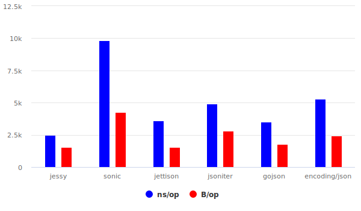

**Jessy** is a high-performance JSON library for Go, focused on speed and reduced memory usage. It's a drop-in replacement for **_encoding/json_**

Before diving into the details, let's start with some metrics

Table of fastest big map encoding for demonstration memory usage

|                 | ns/op     | allocation bytes | allocation times |
| --------------- | --------- | ---------------- | ---------------- |
| jessy ✅        | 232381883 | 321              | 1                |
| jessy-pretty ✅ | 272061406 | 382              | 1                |
| sonic           | 748173167 | 489671300        | 40               |
| jettison        | 292332917 | 510              | 3                |
| jsoniter        | 542650438 | 559997264        | 5500005          |
| gojson          | 344189542 | 337964296        | 100038           |
| encoding/json   | 517449250 | 95207116         | 2700004          |

Marshal in compatibility mode



Fastest encode big map of 100k medium structs


[See all benchmarks](benchmarks)

## Philosophy

- Use reflection only once during the initial type processing
- Perform later processing using only direct unsafe memory access
- Minimize actions, checks, and conditions during repeated traversals
- During the initial type processing, create a unique encoder for each field and nested type/structure
- Always consider memory usage and speed
- Benchmark every change to ensure performance
- Fight for every nanosecond

## API

```go
// This is just a small part of all the available functions

// Marshal with encoding/json compatibility
func Marshal(value any) ([]byte, error)
// Marshal with encoding/json compatibility and \t indents
func MarshalPretty(value any) ([]byte, error)
// Marshal with fair indents (will be extra allocations, recommend use Pretty)
func MarshalIndent(value any, prefix, indent string) ([]byte, error)

// Fastest marshal without compatibility (e.g. unsorted maps)
func MarshalFast(value any) ([]byte, error)
// Fastest marshal with \t indents
func MarshalPrettyFast(value any) ([]byte, error)

// Marshal with custom parameters
func MarshalFlags(value any, flags Flags) ([]byte, error)

// All next append functions perform the same marshal, but use the provided buffer to avoid allocations.
// Highly recommended to use!

// Append json with encoding/json compatibility
func Append(dst []byte, value any) ([]byte, error)
// Fastest append json without compatibility
func AppendFast(dst []byte, value any) ([]byte, error)
// Append json with custom parameters
func AppendFlags(dst []byte, value any, flags Flags) ([]byte, error)

// You can also pre-cache in advance (not required)
func MarshalPrecache(value any, flags Flags)
func MarshalPrecacheFor[T any](flags Flags)


// Usually encoding/json Unmarshal
func Unmarshal(data []byte, v any) error
// Fast encoding/json unmarshal without checks
func UnmarshalTrusted(data []byte, v any) error
```

## More zeroalloc marshal

You can implement special AppendMarshaler/AppendTextMarshaler interface for zeroalloc some structs

```go
type AppendMarshaler interface {
    AppendJSON(dst []byte) (newDst []byte, err error)
}
type AppendTextMarshaler interface {
    AppendText(dst []byte) (newDst []byte, err error)
}
```

## Custom marshal encoder

No matter how much we want to marshal a structure without memory allocations, sometimes our structures contain types from other libraries that we can't change.

The current library provides a way to handle this!

```go
type UnsafeEncoder func(dst []byte, value unsafe.Pointer) ([]byte, error)
type ValueEncoder[T any] func(dst []byte, value T) ([]byte, error)

func AddUnsafeEncoder[T any](encoder func(flags Flags) UnsafeEncoder)
func AddValueEncoder[T any](encoder func(flags Flags) ValueEncoder[T])
```

Using example

```go
import "github.com/avpetkun/jessy-go"

type MyType [10]byte

jessy.AddValueEncoder(func(flags Flags) jessy.ValueEncoder[MyType] {
    return func(dst []byte, v MyType) ([]byte, error) {
        dst = append(dst, '"')
        dst = appendHex(dst, v[:])
        dst = append(dst, '"')
        return dst, nil
    }
})
```

## Drop-in replacement

Replace

```go
import (
    "encoding/json"
)
json.Marshal(data)
```

with

```go
import (
    json "github.com/avpetkun/jessy-go"
)
json.Marshal(data)
```

## Hash

You can get fnv hash by all struct values

```go
import "github.com/avpetkun/jessy-go"

hash, err := jessy.Hash(struct{A int}{123})
```

## Features

In addition to the mentioned benefits, the library also:

- Can marshal complex numbers
- Can marshal maps with any key type

## TODO

- Extend the philosophy to the **Unmarshal** process
- Optimize memory usage for map keys sorting

# How to get

```
go get github.com/avpetkun/jessy-go
```

# Contribution Welcomed !
